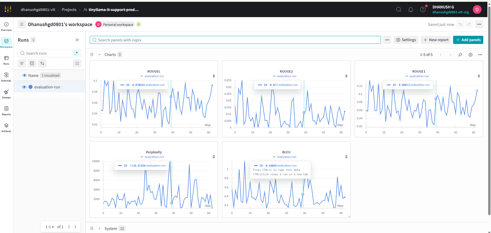
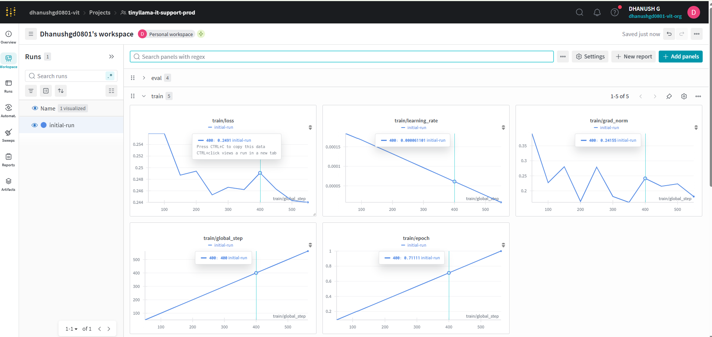
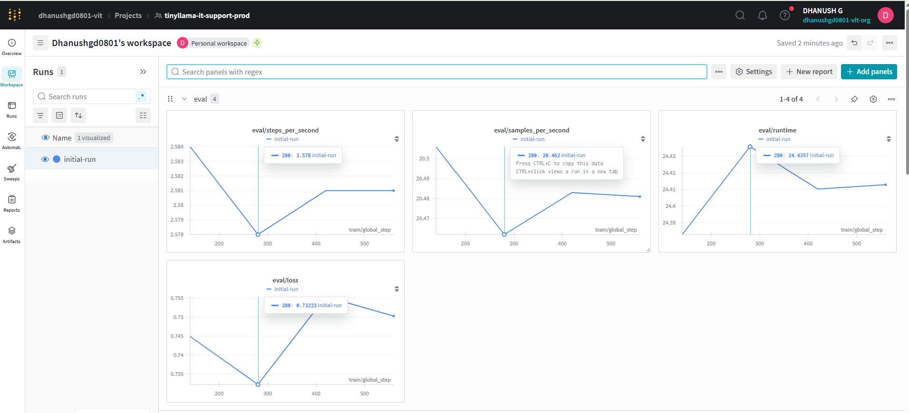
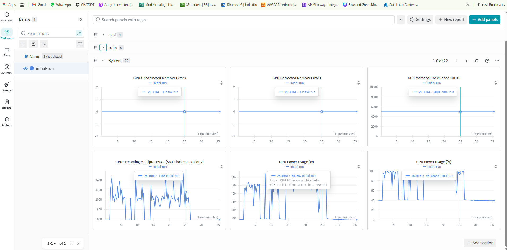
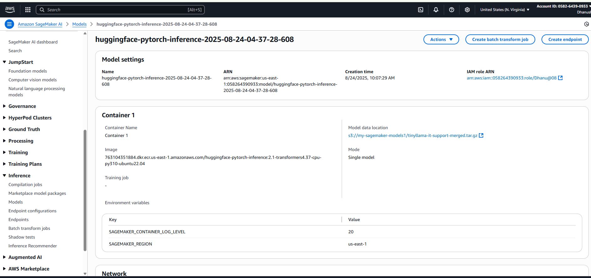

# 🚀 SupportSage: TinyLlama Fine-Tuned on Support Tickets with LoRA/QLoRA (Unsloth), W&B Tracking, and SageMaker Deployment via S3

This project demonstrates an **end-to-end pipeline** for fine-tuning the **TinyLlama-1.1B** model on a **custom Support Ticket QA dataset** using **LoRA** & **QLoRA** with **Unsloth**, tracking experiments with **Weights & Biases**, and deploying the fine-tuned model in **AWS SageMaker** via **Amazon S3**.  

It showcases how to **fine-tune, evaluate, and deploy domain-specific models** efficiently on consumer hardware and scale them on AWS.

---

## 📊 Key Highlights

✅ Fine-tuned **TinyLlama-1.1B** on a curated **5k Support Ticket QA dataset**  
✅ Used **LoRA** & **QLoRA** with **Unsloth** for efficient parameter tuning  
✅ Logged **training & evaluation metrics** in **Weights & Biases**  
✅ Achieved measurable improvements in **BLEU, ROUGE, and Perplexity**  
✅ Uploaded fine-tuned model artifacts to **Amazon S3**  
✅ Deployed model in **AWS SageMaker** for scalable inference  

---

## 🧑‍💻 Tech Stack

| Tech | Purpose |
|---|---|
| [TinyLlama-1.1B](https://huggingface.co/TinyLlama/TinyLlama-1.1B-Chat-v1.0) | Base LLM |
| Custom Support Ticket Dataset | Curated 5k Q&A pairs |
| [Unsloth](https://github.com/unslothai/unsloth) | LoRA & QLoRA fine-tuning |
| [Weights & Biases (W&B)](https://wandb.ai/) | Experiment tracking |
| [Amazon S3](https://aws.amazon.com/s3/) | Model storage |
| [AWS SageMaker](https://aws.amazon.com/sagemaker/) | Model deployment |

---
📌 Use Case

Organizations often deal with repetitive IT support tickets (e.g., Wi-Fi issues, VPN errors, password resets). Instead of routing these to human agents, a fine-tuned LLM like SupportSage can:
- 📨 Automatically respond to support queries with precise, contextual answers
- ⚡ Reduce support workload by handling repetitive tickets instantly
- 🌍 Be deployed on AWS SageMaker and shared via API for integration into chatbots, helpdesk systems, or internal tools

This ensures faster resolutions, lower costs, and consistent support quality.

## 🏗️ Project Workflow

1️⃣ **Prepare Dataset**  
- Support ticket Q&A pairs formatted as CSV (`question,answer`)  

**Example Rows:**  
```csv
question,answer
How do I connect to the office Wi-Fi? (case 1),Open the antivirus software and click on 'Update' or enable auto-updates in settings.
"My VPN connection keeps dropping, how can I fix it? (case 2)","Select the corporate Wi-Fi SSID, enter the provided credentials, and accept security certificates."
```

2️⃣ Fine-Tune with LoRA/QLoRA (via Unsloth)
- Applied LoRA and QLoRA with quantization for efficiency
- Monitored metrics in Weights & Biases

3️⃣ Evaluate Model
- Evaluation metrics tracked:
| Metric     | Value       |
| ---------- | ----------- |
| BLEU       | **0.37774** |
| Perplexity | **126.25**  |
| ROUGE-1    | **0.10875** |
| ROUGE-2    | **0.0119**  |
| ROUGE-L    | **0.09184** |



4️⃣ Upload to Amazon S3
- Saved fine-tuned model weights to Google Drive
- Uploaded artifacts to Amazon S3 bucket for deployment

5️⃣ Deploy Model via AWS SageMaker
- Used S3 model path in SageMaker deployment script
- Configured an endpoint for real-time inference

📓 Colab Notebook

A Colab Notebook is provided in this repo to:
✅ Fine-tune TinyLlama with LoRA/QLoRA and Unsloth
✅ Log metrics with Weights & Biases
✅ Upload trained model to Amazon S3
✅ Deploy in AWS SageMaker
✅ Evaluate metrics (BLEU, ROUGE, Perplexity)

🔬 Proof-of-Concept (PoC) Metrics

✅ Training Logs:





✅ Evaluation Metrics:


✅ GPU Utilization:



✅ S3 Upload:
![S3 Files]screenshots/S3.png)

✅ SageMaker Deployment:


✅ Inference Result:


📓 Contributing

- Feel free to fork this repository, make improvements, or submit issues for bugs or enhancements. Contributions are always welcome!


